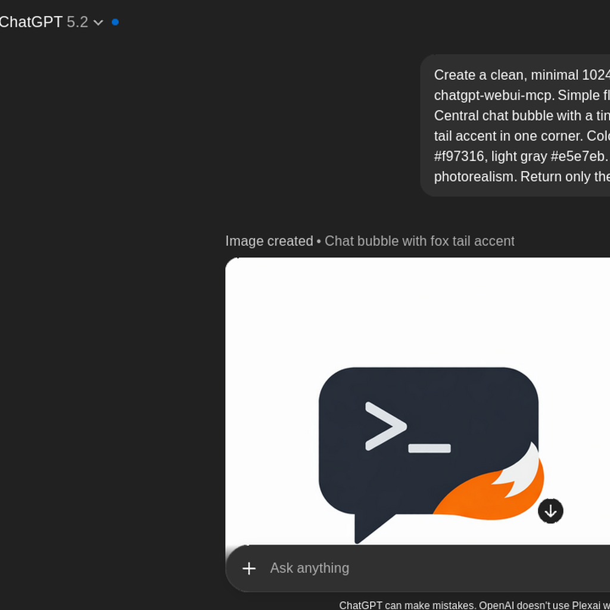

<h1 align="">chatgpt-webui-mcp</h1>

<p align="">
  mcp server for querying chatgpt (chatgpt.com) via webui session token.
</p>

<p align="">
  
</p>

<p align="">
  
  
  
  <a href="https://github.com/Microck/opencode-studio"></a>
</p>

---

## quick start

install from npm:

```bash
npm i -g chatgpt-webui-mcp
```

manual run:

```bash
CHATGPT_SESSION_TOKEN="your_token_here" chatgpt-webui-mcp
```

from source:

```bash
npm install
npm run build
CHATGPT_SESSION_TOKEN="your_token_here" node dist/index.js
```

> important: this uses chatgpt's internal webui api with a session cookie. for personal/local tinkering only - not affiliated with openai.

---

### overview

chatgpt-webui-mcp is a standalone MCP server that drives chatgpt.com via `camofox` (UI automation).

it is built for long-running tasks (gpt-5.2 pro runs that take 1h+), deep research, and image generation mode.

---

### getting your session token

1. open https://chatgpt.com and log in
2. open devtools
3. application -> cookies -> `https://chatgpt.com`
4. copy the value of `__Secure-next-auth.session-token`

---

### configuration

because this server uses `stdio` or `sse`, you configure it as a local command (or remote url) and pass the token via env.

**mcp client config (claude desktop, opencode, etc)**

 ```json
 {
   "mcpServers": {
     "chatgpt-webui": {
       "command": "node",
       "args": ["/absolute/path/to/chatgpt-webui-mcp/dist/index.js"],
        "timeout": 7200000,
         "env": {
           "CHATGPT_SESSION_TOKEN_FILE": "/path/to/session-token.txt",
           "CHATGPT_BROWSER_BASE_URL": "http://127.0.0.1:9377",
           "CHATGPT_WAIT_TIMEOUT_MS": "7200000"
         }
      }
    }
  }
  ```

legacy `CHATGPT_CAMOFOX_*` env vars are still supported for compatibility.
`CHATGPT_TRANSPORT=httpcloak` is optional fallback mode for advanced/debug scenarios.
when model/thinking are omitted, requests default to `gpt-5-2` (auto), not pro.

---

### opencode workflow (the natural language style)

if you want to type commands like:

- `with chatgpt webui on gpt 5.2 pro extended thinking: <prompt>`
- `do deepresearch with chatgpt webui on <topic>`

use this tool:

| tool | what it does |
|------|--------------|
| `chatgpt_webui_command` | parses your sentence into the right call and runs it |

example:

```json
{
  "name": "chatgpt_webui_command",
  "arguments": {
    "command": "with chatgpt webui on gpt 5.2 pro extended thinking: write a 1-page memo about X",
    "mode": "auto"
  }
}
```

---

### long runs (recommended)

use the unified tools:

| tool | description |
|------|-------------|
| `chatgpt_webui_prompt` | main tool. `mode=auto` chooses wait vs background |
| `chatgpt_webui_run` | check/wait for background runs (`run_id`) |

why: deep research and gpt-5.2 pro can take a long time and may exceed a single client timeout. `mode=auto` returns a `run_id` for long jobs.

---

### image generation

set `create_image=true` to switch chatgpt into image generation mode before sending the prompt.

notes:
- `image_urls` is best-effort (derived from page links + visited urls) and may be empty depending on how chatgpt renders images in the webui.
- fallback screenshot output is returned in `image_data_url` (not `image_urls`) when enabled and size-capped.
- enable fallback with `CHATGPT_IMAGE_SCREENSHOT_FALLBACK=1`.
- cap fallback size with `CHATGPT_IMAGE_SCREENSHOT_MAX_BYTES` (default `2097152`, 2 MiB).
- for reliable retrieval, you can also use the conversation_id and open the chatgpt UI.

---

### self-test

```bash
# env
CHATGPT_SESSION_TOKEN="your_token_here" npm run self-test

# cli flag
npm run self-test -- --token "your_token_here"

# file
echo "your_token_here" > ~/.config/chatgpt-webui-mcp/session-token.txt
npm run self-test -- --token-file ~/.config/chatgpt-webui-mcp/session-token.txt
```

---

### remote deployment over tailscale (optional)

if you want background runs to survive for a long time, run this server as an always-on SSE service.

1) copy templates from this repo:
- `deploy/systemd/chatgpt-webui-mcp.env.example`
- `deploy/systemd/chatgpt-webui-mcp-sse.sh`
- `deploy/systemd/chatgpt-webui-mcp.service`

2) install and enable service (user service):

```bash
mkdir -p ~/.config ~/.config/systemd/user ~/.local/bin ~/.local/share/chatgpt-webui-mcp
cp deploy/systemd/chatgpt-webui-mcp.env.example ~/.config/chatgpt-webui-mcp.env
cp deploy/systemd/chatgpt-webui-mcp-sse.sh ~/.local/bin/chatgpt-webui-mcp-sse.sh
cp deploy/systemd/chatgpt-webui-mcp.service ~/.config/systemd/user/chatgpt-webui-mcp.service
chmod 600 ~/.config/chatgpt-webui-mcp.env
chmod 755 ~/.local/bin/chatgpt-webui-mcp-sse.sh
systemctl --user daemon-reload
systemctl --user enable --now chatgpt-webui-mcp.service
```

3) point opencode (cloud host) to the endpoint:

```json
{
  "mcp": {
    "chatgpt-webui": {
      "type": "remote",
      "url": "http://<tailscale-ip>:8791/sse",
      "enabled": true,
      "timeout": 7200000,
      "oauth": false
    }
  }
}
```

---

### tools

| tool | description |
|------|-------------|
| `chatgpt_webui_session` | validate token and return session payload |
| `chatgpt_webui_models` | list available models |
| `chatgpt_webui_command` | natural-language command wrapper |
| `chatgpt_webui_prompt` | unified prompt tool (wait/background) |
| `chatgpt_webui_run` | check/wait for background runs |
| `chatgpt_webui_ask` | direct wait-style prompt tool (legacy/simple) |

---

### project structure

```
chatgpt-webui-mcp/
├── deploy/
│   └── systemd/
│       ├── chatgpt-webui-mcp.env.example
│       ├── chatgpt-webui-mcp-sse.sh
│       └── chatgpt-webui-mcp.service
├── src/
│   ├── index.ts               # MCP server
│   └── chatgpt-webui-client.ts # WebUI automation client
├── package.json
├── tsconfig.json
├── .env.example
├── .gitignore
├── LICENSE
├── INSTALL.md
└── README.md
```

---

### license

mit

---

### author

[Microck](https://github.com/Microck)
